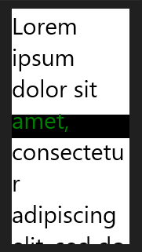
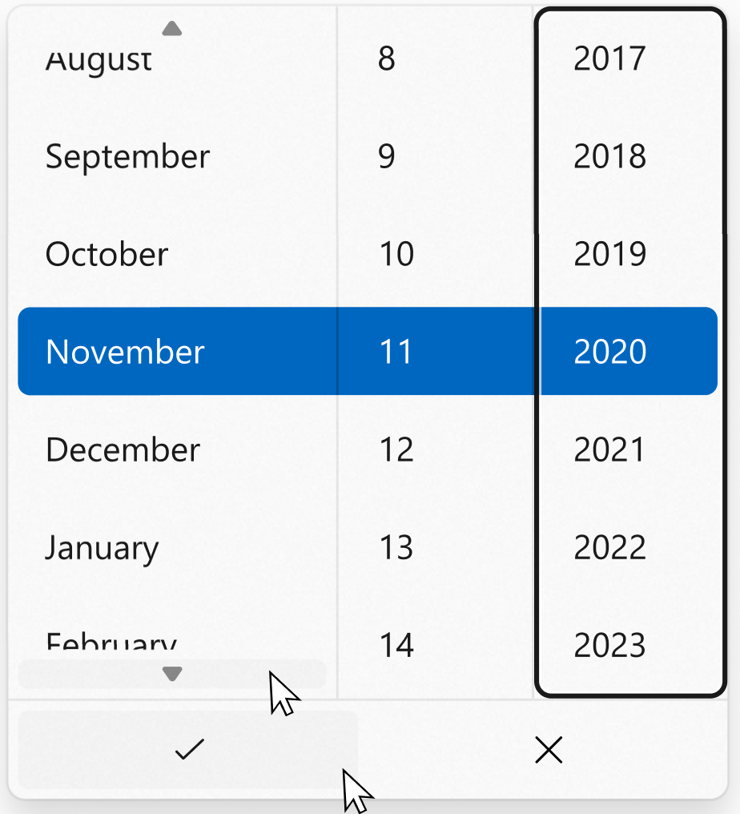

MonochromaticOverlayPresenter
===

# Background

The `MonochromaticOverlayPresenter` API is a Xaml Framework Element that renders the portion of
another element at the same position (typically beneath it in the Z-order), while also applying a
monochromatic colorization effect. This allows the element to appear to be an overlay on top of the
other element.

`MonochromaticOverlayPresenter` element is similar to several precedents:
* [SwapChainBackgroundPanel](https://docs.microsoft.com/uwp/api/Windows.UI.Xaml.Controls.SwapChainBackgroundPanel),
which is a `Grid` that renders its background using a swap chain.
* [CompositionMaskBrush](https://docs.microsoft.com/uwp/api/Windows.UI.Composition.CompositionMaskBrush),
which  is a brush that gets its content from another (source) brush.
* WPF's [VisualBrush](https://docs.microsoft.com/dotnet/api/System.Windows.Media.VisualBrush),
which uses an element's rendering to draw a brush.

`MonochromaticOverlayPresenter` is most similar to the WPF `VisualBrush`, 
the difference being that `MonochromaticOverlayPresenter`
is an element rather than a Brush. So it can't for example be rendered as text foreground.

This new `MonochromaticOverlayPresenter` will be used in the rendering of the 
[DatePicker](https://docs.microsoft.com/uwp/api/Windows.UI.Xaml.Controls.DatePicker)
control.

# API Pages

## MonochromaticOverlayPresenter class

A [Framework Element](https://docs.microsoft.com/windows/winui/api/microsoft.ui.xaml.frameworkelement?view=winui-3.0-preview)
which renders another element at the same position (typically beneath it in the Z-order),
while also applying a monochromatic colorization effect.

```csharp
public class MonochromaticOverlayPresenter : FrameworkElement
{
    public UIElement SourceElement { get; set; }
    public Color ReplacementColor { get; set; }
}
```

Set the `SourceElement` property to indicate which element should be rendered as the
`MonochromaticOverlayPresenter`. The `SourceElement`'s rendering takes place on top of the
`Background`, if a background is set.

The portion of the `SourceElement` rendered inside the `MonochromaticOverlayPresenter` is the portion
that would be rendered at the same location as the `MonochromaticOverlayPresenter`. 
The `SourceElement` is typically placed below the `MonochromaticOverlayPresenter` in the Z-order,
giving the `MonochromaticOverlayPresenter` the appearance of an overlay.

Only the source element's rendering applies to the `MonochromaticOverlayPresenter`; the user
cannot interact with it using the mouse, or move keyboard focus to it. However,
`MonochromaticOverlayPresenter` will render system focus visuals, regardless of what the
[UseSystemFocusVisuals](https://docs.microsoft.com/uwp/api/Windows.UI.Xaml.Controls.Control.UseSystemFocusVisuals) 
property is set to. To avoid this, you should inset the margins to remove it.

> Note: the element set as the `SourceElement` cannot be an ancestor or in the descendancy of 
the `MonochromaticOverlayPresenter`. However the `SourceElement` must be in the same XAML tree as 
the `MonochromaticOverlayPresenter`.


If the `ReplacementColor` property is set and has a nonzero Alpha value, then the `SourceElement` 
is treated as a mask: every non-transparent pixel will be replaced by this color. The RGB value 
of the `ReplacementColor` (not the Alpha value) will overwrite the RGB of the source. 
The default value for `ReplacementColor` is Transparent.


### MonochromaticOverlayPresenter examples

The following example puts an `MonochromaticOverlayPresenter` on top of (z-ordered above)
some scrolling text, causing the center of the text to be highlighted, even as it's scrolling.
Things to note:
* The `MonochromaticOverlayPresenter` is sourcing from the `TextBlock`, it's also z-ordered above
the same `TextBlock`. If the `Background` and `SourceElement` properties weren't set,
it would have no effect; it would render the `TextBlock` exactly on top of itself.
* The `Background` property is black, and the `ReplacementColor` is green, causing
the overlay text to be displayed as green on black.
* The `MonochromaticOverlayPresenter` is positioned and given a height such that it's a black band
across the center of the scrolling text.
* The `MonochromaticOverlayPresenter.IsHitTestVisible` property is set to False, so that input still goes to the ScrollViewer that is z-ordered behind it.

```xml
<Grid Background="White" Width="150">
    <ScrollViewer x:Name="Source" Height="300">
        <TextBlock
            Foreground="Black"
            FontSize="30"
            Text="{x:Bind LoremIpsum}"
            TextWrapping="Wrap">
        </TextBlock>
    </ScrollViewer>

    <MonochromaticOverlayPresenter
        ReplacementColor="Green"
        Background="Black"
        SourceElement="{x:Bind Source}"
        Height="30"
        IsHitTestVisible="False"
        VerticalAlignment="Center"
        HorizontalAlignment="Stretch"/>
</Grid>
```



The example below shows how the new `MonochromaticOverlayPresenter` API can be used to partially highlight a TextBlock.

```xml
 <Grid Background="{ThemeResource ApplicationPageBackgroundThemeBrush}">
        <StackPanel x:Name="Panel" Orientation="Vertical" HorizontalAlignment="Center" VerticalAlignment="Center">
            <Grid Margin="2,10,0,0">
                <TextBlock x:Name="Source" Text="This string will be partially highlighted"/>
                <MonochromaticOverlayPresenter
                    ReplacementColor="Black"
                    SourceElement="{x:Bind Source}"
                    Width="50"
                    VerticalAlignment="Stretch"
                    HorizontalAlignment="Center"
                    Background="LightBlue"/>
            </Grid>
        </StackPanel>
    </Grid>
```

> Todo: add a reflection example (classic use of VisualBrush in WPF)

### MonochromaticOverlayPresenter theme resources

You can modify the default Style and ControlTemplate to give the control a unique appearance. 
For more info, see the 
[Light-weight styling section](https://docs.microsoft.com/en-us/windows/uwp/design/controls-and-patterns/xaml-styles#lightweight-styling)
of the 
[Styling controls](https://docs.microsoft.com/en-us/windows/uwp/design/controls-and-patterns/xaml-styles)
article.

`MonochromaticOverlayPresenter` defines the following new resource:

```xml
<StaticResource x:Key="DatePickerFlyoutPresenterHighlightForegroundColor" ResourceKey="TextOnAccentAAFillColorPrimary" />
```


## Other MonochromaticOverlayPresenter members

| Name | Description |
| - | - |
| SourceElement | Gets or sets the UIElement to render inside the `MonochromaticOverlayPresenter`. |
| ReplacementColor | Gets or sets the Color to use instead of the non-transparent pixels of the SourceElement.


# API Details

```csharp
namespace Microsoft.UI.Xaml.Controls.Primitives
{

[MUX_PROPERTY_CHANGED_CALLBACK(TRUE)]
[MUX_PROPERTY_CHANGED_CALLBACK_METHODNAME("OnPropertyChanged")]
unsealed runtimeclass MonochromaticOverlayPresenter : Windows.UI.Xaml.Controls.FrameworkElement
{
    MonochromaticOverlayPresenter();

    Windows.UI.Xaml.UIElement SourceElement { get; set; };
    Windows.UI.Color ReplacementColor { get; set; };

    static Windows.UI.Xaml.DependencyProperty SourceElementProperty{ get; };
    static Windows.UI.Xaml.DependencyProperty ReplacementColorProperty{ get; };
}

}
```


# Appendix
<!-- Anything else that you want to write down for posterity, but 
that isn't necessary to understand the purpose and usage of the API.
For example, implementation details. -->

## DatePicker

In WinUI 2.2, controls began to be re-designed to have rounded corners, marking a shift in our overall design language. 
There's more information on rounded corners in WinUI [here](https://docs.microsoft.com/en-us/windows/uwp/design/style/rounded-corner), 
but the general purpose of the rounded corners design shift is to evoke warmth and trust, 
and make the UI easier for users to visually process. 
Since this shift, certain controls have adopted the new styling and recieved rounded corners, but some have not. 
This creates a strong visual inconsistency in WinUI apps, where certain pieces of an app may look modern and others may look dated. 
Examples of this include the DatePicker and TimePicker controls. While the corners of the controls themselves are rounded, the selection rectangle within the control is still squared off. Buttons and other areas inside these controls are also still squared off, making them look dated when placed alongside other controls that are more modernly designed, such as 
[NavigationView](https://docs.microsoft.com/en-us/windows/uwp/design/controls-and-patterns/navigationview).

Recently, [ListView was given design updates](https://github.com/microsoft/microsoft-ui-xaml-specs/blob/user/anawish/ListViewGridViewDesignUpdates/active/ListViewGridView/listviewgridview-designupdates.md) to round the corners of its items. DatePicker and TimePicker should follow in these footsteps, and make sure that they adopt any of the ListView design elements that are relevant. This includes general rounding of selection visuals, as well as rounded grey backplates for items that get hovered. 

This spec will detail a number of changes to update the designs of DatePicker and TimePicker so that they are more 
visually aligned with modern WinUI controls. At a high level, some key parts of these updated styles are: a rounded selection rectangle; rounded backplates on items, buttons, and scroll buttons on  hover; and new animations that are aligned with other controls. 

These visual changes to DatePicker and TimePicker will in part be made possible by the new `MonochromaticOverlayPresenter` API which is described above. This class provides the logic behind displaying the 'inverted' selection rectangle that spans across all three columns in DatePicker and TimePicker, and giving it the correct foreground color to have appropriate contrast over the accent colored background.

### Visual Examples
<!-- Use this section to provide a brief description of the feature.
For an example, see the introduction to the PasswordBox control 
(http://docs.microsoft.com/windows/uwp/design/controls-and-patterns/password-box). -->

**DatePicker:**

As you can see on the left, the old version of DatePicker contains squared elements inside of it. The new version of DatePicker will round off these elements.


**TimePicker:**

Similarly to DatePicker, the old version of TimePicker contains squared elements inside of it. The new version of TimePicker will round off these elements.


**Rounded backplates and focus visuals**

As you can see in the mockup below, all buttons and items (individual cells) within DatePicker and TimePicker will receive a rounded grey backplate when hovered or pressed. In addition to this, columns within DatePicker and TimePicker will receive rounded focus rectangles (as shown below).




## Detailed Task Breakdown for styling implementation
The following steps apply to both DatePicker and TimePicker, unless otherwise noted.

1. The background color of the overall flyout should change, as shown in mockups above.

2. Selected items (entire rows) should have a rounded (4px corner radius) accent-color backplate. This backplate should have a 32px height, and have 4px margin on the left/right and 2px margin on the top/bottom from its overall footprint. 

3. When items (individual cells, i.e. "November") are in a hover or pressed state, they will have a rounded (4px corner radius) grey backplate, with the same margins from its overall footprint as the selection row has described above. This backplate should also be 32px in height. 

4. The scroll up/down button visuals should use caret icons (rather than the current chevron icons). 

5. When the scroller buttons are hovered, they should have a rounded grey backplate that have a height of 12px, and a 4px margin on all sides from their overall button footprints.

6. The check and X buttons at the bottom of the Date/TimePicker should also be updated to use new icons as shown in mockups above.

7. On hover, the check and X buttons should also receive a rounded gray backplate with 4px margins on all sides from its overall button footprint.

8. Focus visuals for all buttons need to be rounded. 

9. **DatePicker only**: Items in columns should now be left-aligned, rather than center-aligned as they were previously. 

10. Columns within an expanded Date/TimePicker can be focused upon. For the column focus, the black focus rectangle will need to be rounded.

11. Animations: Date/TimePicker should have an opening/closing animation and use the same easing/timing as other controls.
